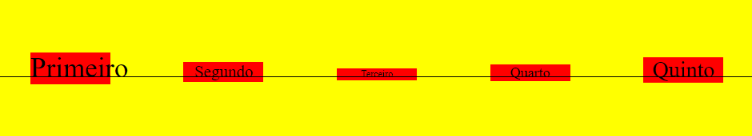
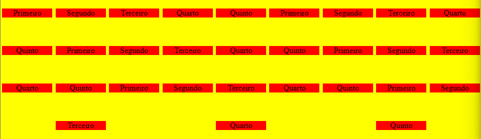
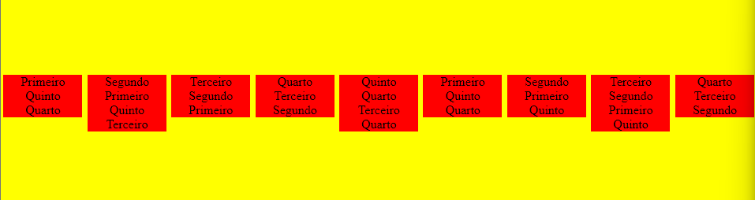
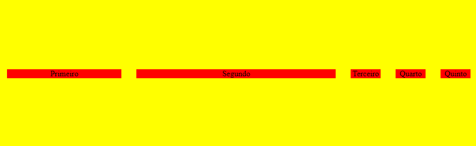

- [Voltar ao início](../README.md)

### Flexbox

O flexbox é uma forma de distribuir as tags pela tela. Para definir um container como flex, basta utilizar o atributo `display`:

```css
.flex-container {
    display: flex;
}
```

A seguir temos a estrutura de um flexbox:



#### Direcionamento

O flexbox possui algumas configurações como padrão. A seguir, algumas são listadas: 

- **flex-direction**: indica a direção do eixo principal do flex.

    - *row* (padrão): linha ou horizonal;
    - *column*: coluna ou vertical;
    - *row-reverse*: linha ou horizonal com a ordem invertida;
    - *column-reverse*: coluna ou vertical com a ordem invertida.

- **justify-content**: ajusta o alinhamento dos itens no eixo principal.

    - *flex-start* (padrão): alinha no início do eixo principal;
    - *flex-end*: alinha no fim do eixo principal;
    - *center*: alinha no centro do eixo principal;
    - *space-around*: distribui os itens colocando o espaço vazio ao redor dos itens (com espaço reduzido entre as bordas);
    - *space-between*: distribui os itens colocando o espaço vazio entre os itens (sem espaço entre as bordas);
    - *space-evenly*: distribui os itens colocando o espaço vazio igualmente entre itens (com espaço entre as bordas).

- **align-items**: ajusta o alinhamento dos itens no eixo perpendicular.

    - *stretch* (padrão): estica os elementos no tamanho do eixo perpendicular;
    - *flex-start*: alinha no início do eixo perpendicular;
    - *flex-end*: alinha no fim do eixo perpendicular;
    - *center*: alinha no centro do eixo perpendicular;
    - *basline*: alinha na linha base da fonte (similar como se estivesse escrevendo o texto em uma linha de caderno).
    

- **align-self**: passado no css do item, altera o alinhamento de um único item. Possui os mesmos valores que o `align-items`

- **align-content**: ajusta o alinhamento do bloco dos itens no eixo perpendicular. Possui os mesmos valores que o `align-items`. A seguir veja a diferença visual entre o `align-items` e o `align-content`:
    
    `align-items: center`:
    

    `align-content: center`:
    

#### Outras configurações

- **flex-wrap**: define a quebra de linha quando a quantidade de itens passar do tamanho do flexbox.
    - *nowrap* (padrão): não quebra a linha;
    - *wrap*: quebra a linha.

- **flex-flow**: abrevia as informações do `flex-direction` e `flex-wrap`. Assim, pode-se substituir

    ```css
    flex-direction: row;
    flex-wrap: wrap;
    ```
    por

    ```css
    flex-flow: row wrap;
    ```

- **flex-grow**: permite com que o elemento se espalhe pelo espaço que sobra dentro do container e quanto maior o número passado, mais espaço o item terá de forma proporcional (0 por padrão). Veja o exemplo a seguir:

    ```css
    .flex-item {
        width: 60px;
    }

    .primeiro {
        flex-grow: 1;
    }

    .segundo {
        flex-grow: 2;
    }
    ```

    

- **flex-basis:** define um espaço mínimo para cada elemento antes de distribuir o espaço vazio com `flex-grow` (funciona de forma similar ao `min-width`);

- **flex-shrink:** quando 0, mantém o item sempre com o tamanho mínimo definido no `flex-basis` (permite que o item aumente o tamanho sem problemas);

- **flex:** serve como atalho para `flex-grow`, `flex-shrink` e `flex-basis`. Assim, pode-se substituir

    ```css
    flex-grow: 2;
    flex-shrink: 0;
    flex-basis: 100px
    ```
    por

    ```css
    flex: 2 0 100px;
    ```

- **order:** define uma ordem personalizada para cada item.

- Para mais atributos relacionados ao `flexbox` ou para uma explicação mais detalhada, acesse [aqui](https://css-tricks.com/snippets/css/a-guide-to-flexbox/).

### Grid

