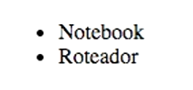
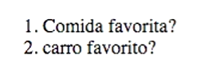
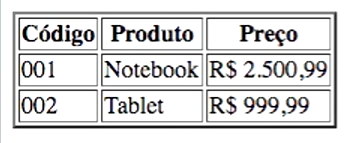

- [Voltar ao início](../README.md)

### Estrutura HTML

A estrutura principal do HTML é composta pelas tags `<head></head>` e `<body></body>`. A tag `<head>` é composta por informações que não aparecem diretamente na página, como estruturas de formatação, códigos javascript, etc. A tag `<body>` é composta pela estrutura da página em si.

#### Tag `<head>`

A seção apresenta algumas estruturas importantes presentes na tag `<head></head>`:

- `<title></title>`: Define o título na página a ser exibido na guia.
- `<meta>`: define informações de metadados.
    - `charset="utf-8"`: define a codificação da página web.

### Formatação de textos

Os **cabeçalhos** utilizadas para formatação de texto. Definem títulos na página. São definidas da seguinte forma no HTML:

```html
<h1></h1>
<h2></h2>
<h3></h3>
<h4></h4>
<h5></h5>
<h6></h6>
```

O tamanho do cabeçalho diminui conforme o número que é inserido na tag. A "importância" do cabeçalho também diminui conforme o número, sendo `<h1></h1>` o cabeçalho mais importante da página.

Os **parágrafos** exibem um texto na página. São definidos da seguinte forma no HTML:

```html
<p></p>
```

É possível adicionar **linhas horizontais** para a separação de textos ou seções com a seguinte tag: 

```html
<hr>
```

A seguir estão algumas tags para formatação de textos:

- `<strong></strong>`: deixar o texto em negrito;
- `<em></em>`: deixar o texto em itálico;
- `<u></u>`: deixar o texto grifado;
- `<strike></strike>`: deixar o texto riscado (como se estivesse errado);

### Listagem

#### Lista não ordenada

Para a criação de uma lista não ordenada, basta utilizar a tag `<ul></ul>` e, para cada item da lista, a tag `<li></li>`. Veja: 

```html
<ul>
    <li>Notebook</li>
    <li>Roteador</li>
</ul>
```



É possível alterar o ícone que faz a listagem com o parâmetro `type`, sendo possível utilizar:

- circle
- square
- disc

#### Lista ordenada

Para a criação de uma lista ordenada, basta utilizar a tag `<ol></ol>` e, para cada item da lista, a tag `<li></li>`. Veja: 

```html
<ol>
    <li>Comida favorita?</li>
    <li>Carro favorito?</li>
</ol>
```



É possível alterar valor de ordenação com o parâmetro `type`, sendo possível utilizar:

- 1
- A
- a
- I
- i

### Imagem

O HTML permite inserir imagens dentro da página com a tag `` e utilizando alguns parâmetros. Veja: 

```html

```

Vale ressaltar que as boas práticas pedem um outro parâmetro para caso a imagem não carregue, independente do motivo:

- `alt`: Define um texto alternativo que descreve a imagem.

### Link entre páginas

o HTML permite fazer links entre páginas com a tag `<a></a>`. Para isso, é necessário o uso de um parâmetro: 

- `href="caminho_do_arquivo"`: faz a referência para a outra página.

### Tabelas

O HTML permite criar tabelas da seguinte forma: 

- `<table></table>`: cria a tabela;
- `<tr></tr>`: cria uma linha para a tabela;
- `<th></th>`: cabeçalho da coluna da tabela;
- `<td></td>`: dados da tabela.
    - `colspan`: indica quantas colunas o dado da tabela vai ocupar.
    - `rowspan`: indica quantas linhas o dado da tabela vai ocupar.

Veja uma tabela formada: 

```html
<table>
    <tr>
        <th>Código</th>
        <th>Produto</th>
        <th>Preço</th>
    </tr> 

    <tr>
        <td>001</td>
        <td>Notebook</td>
        <td>R$ 2.500,99</td>
    </tr> 

    <tr>
        <td>002</td>
        <td>Tablet</td>
        <td>R$ 999,99</td>
    </tr> 
</table>
```



### Formulário

O formulário é definido pelo HTML com a tag `<form></form>` e, dentro da tag, outros componentes são utilizados, como: 

- `<input>`: campo de texto para que o usuário insira dados.
    - `name`: importante para a coleta de dados inseridos.
    - `type`: define o tipo do componente, como text, password, button, submit, radio (mesmo 'name' para possibilitar marcar apenas um), checkbox e etc.
    - `value`: assim como o 'name', é importante para a coleta dos dados inseridos, porém trata cada 'input' de forma individual.

- `<select></select>`: campo de texto para que o usuário selecione alguma opção.
    - `<option></option>`: define uma opção para o `<select>`.
    - no caso do `<select>` o atributo 'name' deve ser inserido no próprio `<select>`, enquanto o 'value' deve ser inserido no `<option>`

- `<textarea></textarea>`: caixa de texto com mais linhas.